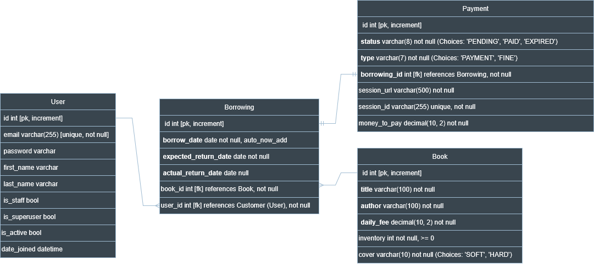

# Library Service API

A comprehensive **Books Borrowing Management System** built with Django Rest Framework (DRF) that provides RESTful API endpoints for managing books, borrowings, user authentication, payments, and notifications.

## Features

- **Book Management** - Complete CRUD operations with automatic inventory tracking
- **User Authentication** - JWT-based authentication with custom email-as-username model
- **Borrowing System** - Streamlined book borrowing and return workflow
- **Payment Integration** - Secure Stripe integration for payments and fine processing
- **Real-time Notifications** - Telegram bot integration for instant updates
- **API Documentation** - Interactive Swagger/Redoc documentation
- **Permission Control** - Role-based access control for administrative functions
- **Containerization** - Docker-ready deployment with PostgreSQL

## Technology Stack

| Component | Technology | Purpose |
|-----------|------------|---------|
| **Backend Framework** | Python 3.10, Django 4.x | Core application framework |
| **API Framework** | Django Rest Framework | RESTful API implementation |
| **Database** | PostgreSQL | Primary data storage |
| **Authentication** | JWT (Simple JWT) | Secure token-based authentication |
| **Payment Processing** | Stripe API | Payment and fine handling |
| **Documentation** | DRF Spectacular | OpenAPI schema generation |
| **Notifications** | Telegram Bot API | Real-time messaging |
| **Containerization** | Docker, Docker Compose | Deployment and orchestration |
| **Web Server** | Gunicorn | Production WSGI server |

## Database Architecture

The system uses PostgreSQL with four core models and well-defined relationships:



### Core Models

#### **User Model** (Custom Authentication)
```
id (PK, auto-increment)
email (unique, serves as username)
password (hashed)
first_name, last_name
is_staff, is_superuser, is_active
date_joined (timestamp)
```

#### **Book Model** (Inventory Management)
```
id (PK, auto-increment)
title (varchar 100)
author (varchar 100)  
daily_fee (decimal 10,2)
inventory (integer, >= 0)
cover (choices: 'SOFT', 'HARD')
```

#### **Borrowing Model** (Transaction Tracking)
```
id (PK, auto-increment)
borrow_date (auto-set)
expected_return_date
actual_return_date (nullable)
book_id (FK → Book)
user_id (FK → User)
```

#### **Payment Model** (Stripe Integration)
```
id (PK, auto-increment)
status (choices: 'PENDING', 'PAID', 'EXPIRED')
type (choices: 'PAYMENT', 'FINE')
borrowing_id (FK → Borrowing)
session_url (varchar 500)
session_id (varchar 255, unique)
money_to_pay (decimal 10,2)
```

### Relationships
- **User** ↔ **Borrowing**: One-to-Many
- **Book** ↔ **Borrowing**: One-to-Many  
- **Borrowing** ↔ **Payment**: One-to-Many

### Database Features
- Automatic inventory management (decrements/increments on borrow/return)
- Constraint validation (inventory >= 0)
- Optimized indexing on frequently queried fields
- Foreign key constraints for data integrity

## Payment Service Integration

### Stripe Payment Flow
1. **Session Creation** → Stripe checkout session generated
2. **User Redirect** → Secure Stripe payment page
3. **Payment Processing** → Real-time status tracking
4. **Webhook Handling** → Success/cancel callback processing

### Key Payment Functions

#### `create_stripe_session(request, borrowing, amount, payment_type)`
- Creates Stripe checkout session with dynamic URLs
- Generates Payment record with `PENDING` status
- Supports both regular payments and fines
- Handles currency conversion (USD)

#### `create_fine_payment(request, borrowing, fine_amount)`
- Specialized fine processing for overdue returns
- Calculates fine based on days overdue
- Integrates with main payment flow

### Payment Features
- **Secure Processing** - All transactions through Stripe
- **Multiple Payment Types** - Initial payments and overdue fines
- **Session Tracking** - Complete audit trail
- **Real-time Status** - Immediate payment confirmation
- **Error Handling** - Robust failure recovery

## Notification Service

### Telegram Integration
Real-time notifications sent to configured Telegram chat for:
- New book borrowings
- Book returns
- Payment completions
- System alerts

### Configuration
```bash
TELEGRAM_BOT_TOKEN=your_bot_token_here
TELEGRAM_CHAT_ID=your_chat_id_here
```

### Notification Function
#### `send_telegram_message(message: str)`
- **Asynchronous** - Non-blocking API calls
- **Fault Tolerant** - Continues operation if Telegram unavailable
- **Timeout Protection** - 5-second request timeout
- **Flexible Messaging** - Supports any message format

### Example Notifications
```
New borrowing: john@email.com borrowed 'Django Guide' until 2025-10-05
Book returned: jane@email.com returned 'Python Basics'
Payment completed: $15.50 for borrowing 'Advanced Django'
```

## Quick Start

### Prerequisites
- Docker and Docker Compose installed
- Stripe account (for payments)
- Telegram bot (for notifications)

### 1. Setup
```bash
  # Clone repository
    git clone https://github.com/turulko-oleksandr/library-service-api.git
    cd library-service-api

  # Create environment file
  cp .env.sample .env
```

### 2. Environment Configuration
Edit `.env` with your credentials:
```env
SECRET_KEY=your-django-secret-key
STRIPE_SECRET_KEY=sk_test_...
STRIPE_PUBLISHABLE_KEY=pk_test_...
TELEGRAM_BOT_TOKEN=your-telegram-bot-token
TELEGRAM_CHAT_ID=your-telegram-chat-id
```

### 3. Launch with Docker
```bash
# Build and start services
docker-compose up --build

# Create admin user (in separate terminal)
docker-compose exec app python manage.py createsuperuser
```

### 4. Access the API
- **API Base URL**: `http://localhost:8080/api/`
- **Swagger Documentation**: `http://localhost:8080/api/schema/swagger-ui/`
- **Redoc Documentation**: `http://localhost:8080/api/schema/redoc/`
- **Admin Panel**: `http://localhost:8080/admin/`

## Docker Configuration

### Dockerfile
```dockerfile
FROM python:3.10-slim
WORKDIR /app
RUN apt-get update && apt-get install -y gcc libpq-dev
COPY requirements.txt .
RUN pip install --no-cache-dir -r requirements.txt
COPY . .
CMD ["gunicorn", "--bind", "0.0.0.0:8080", "library_service.wsgi:application"]
```

### Docker Compose Services
- **app**: Django application with Gunicorn
- **db**: PostgreSQL 16 Alpine
- **volumes**: Persistent data storage (postgres_data, static_data, media_data)

### Startup Sequence
1. Database connection wait (`wait_for_db`)
2. Database migrations (`migrate`)
3. Static files collection (`collectstatic`)
4. Test execution (`test`)
5. Fixture loading (`loaddata`)
6. Gunicorn server start

## API Endpoints

| Endpoint | Method | Description | Auth Required |
|----------|--------|-------------|---------------|
| `/users/register/` | POST | User registration | No |
| `/users/token/` | POST | JWT token acquisition | No |
| `/users/token/refresh/` | POST | Token refresh | No |
| `/users/me/` | GET/PUT/PATCH | User profile management | Yes |
| `/library/books/` | GET/POST | Book listing/creation | Read: No, Write: Admin |
| `/library/books/{id}/` | GET/PUT/PATCH/DELETE | Book detail operations | Read: No, Write: Admin |
| `/library/borrowings/` | GET/POST | Borrowing management | Yes |
| `/library/borrowings/{id}/` | GET | Borrowing details | Yes |
| `/library/borrowings/{id}/return/` | POST | Book return processing | Yes |
| `/library/payments/` | GET | Payment history | Yes |
| `/library/payments/success/` | GET | Stripe success callback | Yes |
| `/library/payments/cancel/` | GET | Stripe cancel callback | Yes |

### Authentication Headers
```http
Authorization: Bearer <your_jwt_access_token>
```

### Example API Usage

#### Register User
```bash
  curl -X POST http://localhost:8080/api/users/register/ \
  -H "Content-Type: application/json" \
  -d '{"email": "user@example.com", "password": "securepass123"}'
```

#### Get JWT Token
```bash
curl -X POST http://localhost:8080/api/users/token/ \
  -H "Content-Type: application/json" \
  -d '{"email": "user@example.com", "password": "securepass123"}'
```

#### Create Borrowing
```bash
  curl -X POST http://localhost:8080/api/library/borrowings/ \
  -H "Authorization: Bearer <token>" \
  -H "Content-Type: application/json" \
  -d '{"book": 1, "expected_return_date": "2025-10-15"}'
```

## Development

### Running Tests
```bash
  docker-compose exec app python manage.py test
```

### Database Management
```bash
  # Create migrations
docker-compose exec app python manage.py makemigrations

  # Apply migrations  
docker-compose exec app python manage.py migrate

  # Load sample data
docker-compose exec app python manage.py loaddata fixture.json
```

### Logs
```bash
# View application logs
docker-compose logs app

# Follow logs in real-time
docker-compose logs -f app
```

## Configuration

### Environment Variables
| Variable | Description | Required |
|----------|-------------|----------|
| `SECRET_KEY` | Django secret key | Yes |
| `DEBUG` | Debug mode (True/False) | No |
| `DATABASE_URL` | PostgreSQL connection string | No |
| `STRIPE_SECRET_KEY` | Stripe secret key | Yes |
| `STRIPE_PUBLISHABLE_KEY` | Stripe publishable key | Yes |
| `TELEGRAM_BOT_TOKEN` | Telegram bot token | No |
| `TELEGRAM_CHAT_ID` | Telegram chat ID | No |

### Security Considerations
- JWT tokens have configurable expiration times
- All passwords are hashed using Django's built-in system
- Stripe handles sensitive payment data (PCI compliant)
- Admin endpoints restricted to staff users
- CORS configured for production deployment
